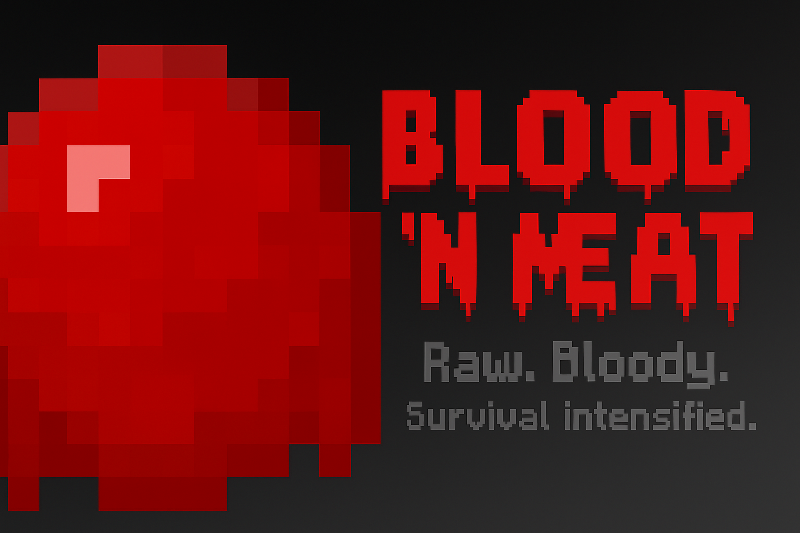

# 🩸 Blood 'n Meat
### *Raw. Bloody. Survival intensified.*

---

## 🧬 Overview
**Blood 'n Meat** is a **hybrid semi-technology/magic Minecraft mod** currently in very early development. It explores the fusion of **blood, flesh, and machinery**, allowing players to interact with dark alchemy, techno-organic machines, and corruption mechanics.

Players can follow the path of **Living Flesh**, **Undead Flesh**, or merge both to master the forbidden art of **blood-powered techno-magic**.

---

## ⚙️ Development Status
**Blood 'n Meat** is in a <em>very early stage</em>. Most planned mechanics and systems are still conceptual, in testing, or design phases.  
Development starts with fundamental resources and item materials, which will expand into:

- **Techno-magic systems**  
- **Corruption mechanics**  
- **Bloodrealm dimension**

> **Current state:** Alpha Pre-Content Build (v0.0.1)  
> **Planned progression:** Alpha → Beta → Early Access → Full Release

---

## 🩸 Current Content (v0.0.1)
The foundational items introduced so far form the base materials for future systems and crafting recipes:

- **Coagulated Blood** – hardened organic blood mass used in early alchemy and crafting.  
- **Blood Droplet** – a core essence item dropped from living or undead entities.  
- **Blood-Splattered Iron Ingot** – iron infused with blood essence for techno-flesh crafting.  
- **Blood Ingot** – refined metallic-blood hybrid material for machinery and armor.

> *Note: These items currently have no functional mechanics but will serve as building blocks for upcoming features.*

---

## 🧬 Planned Features & Roadmap
Core mechanics and systems planned for future versions:

- **Bloodflow Energy System** – hybrid organic-mechanical energy powering rituals and machinery.  
- **Corruption Progression** – evolve player abilities and mutations at the cost of sanity and control.  
- **Techno-Flesh Crafting** – combine biological materials with metal for biomechanical items.  
- **Flesh & Blood Pathways** – unique player progression trees: Flesh (life) or Blood (undeath).  
- **Bloodrealm Dimension** – an organic, pulsating world of blood rivers, living machinery, and horrors.  
- **Integration Support** – compatibility with JEI, Curios, Patchouli, and other popular mods.

> *These concepts are subject to change as development continues.*

---

## 🔗 Links & Resources
- [GitHub Repository](https://github.com/SupGamerNL/Blood-n-Meat) – official source code and dev updates  
- [CurseForge Page](https://www.curseforge.com/minecraft/mc-mods/blood-n-meat) – downloads and changelogs  
- [Modrinth Page](https://modrinth.com/mod/blood-n-meat) – alternate release platform  
- [Developer Profile – SupGamer NL](https://github.com/SupGamerNL)

---

## 🧠 Technical Information

| Component      | Version                 |
|----------------|-------------------------|
| **Minecraft**  | 1.21.8                  |
| **Modloader**  | NeoForge                |
| **Version**    | 21.8.31                 |
| **Built With** | MCreator 2025.3         |
| **Status**     | Work-In-Progress (Alpha)|

---

## 🖼️ Gallery

|  |  |
|--|--|
|  |  |

---

## 🧰 Contributing
This project is **in early development**. Feedback, suggestions, and pull requests are welcome.  
Contribute ideas, textures, or balance feedback by opening an **Issue** or discussing in the **Discussions** tab.

---

## 🧾 License
This project is licensed under the **MIT License** — free to use, modify, or include in modpacks with proper credit.

---

## 🧑‍💻 Author
**Developed by [SupGamer NL](https://github.com/SupGamerNL)**  
Blending *dark fantasy* with *mechanical innovation* in Minecraft.

---

> © 2025 SupGamer NL — All Rights Reserved.  
> “Through flesh, we grow. Through blood, we ascend.”
